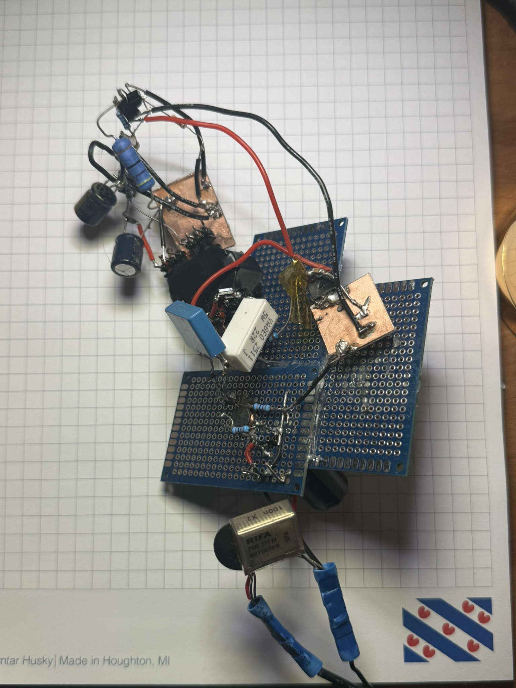
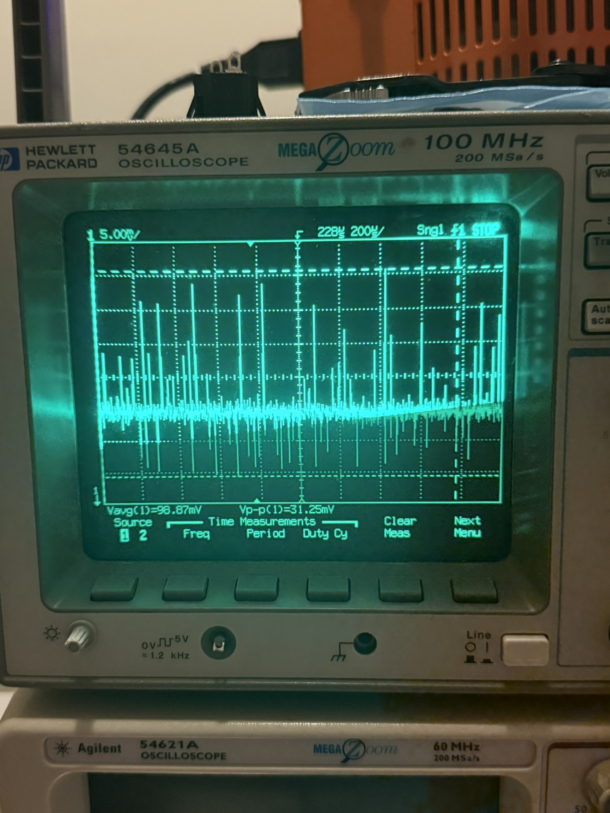
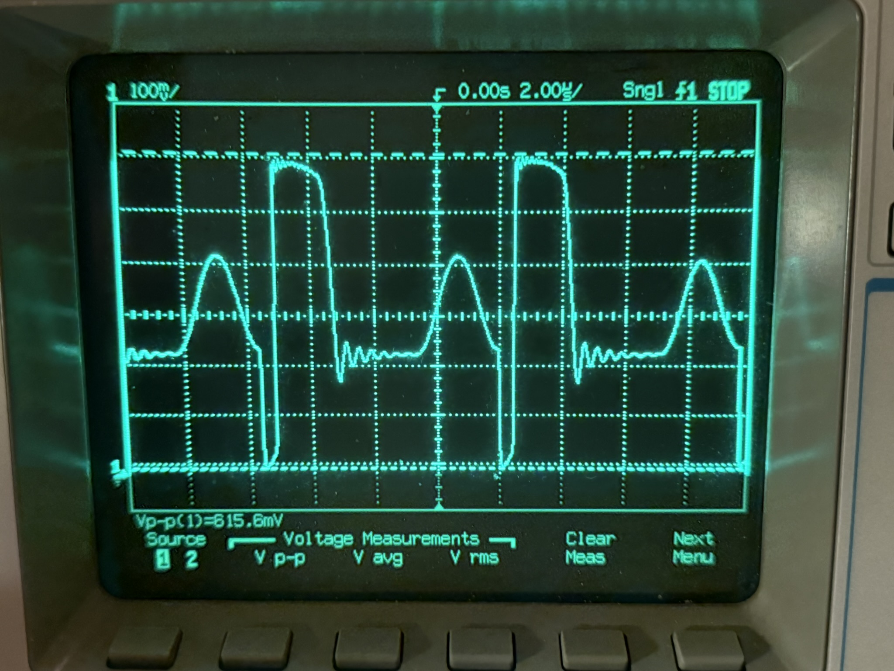

# Offline Flyback SMPS - Custom Transformer

Bench-validated offline flyback switch-mode power supply using a custom hand-wound RM10/I transformer and a Power Integrations TNY285 TinySwitch controller.

This project documents the design, prototyping, measurement, and PCB transition of an isolated 120 VAC to 5 V flyback supply. The prototype was first built dead-bug style for unrestricted probing and bring-up, then transitioned toward a 4-layer PCB for layout cleanup, loop injection, and efficiency/ripple improvement.

## Bench Validation Images

### Dead-bug Prototype

The first working prototype was built dead-bug style for unrestricted probing, fast component swaps, and direct observation of switching behavior before PCB layout cleanup.

### Output Waveform

Bench output waveform under load. This capture corresponds to approximately 4.94 V output validation with a 22 ohm load.

### Drain Waveform

Primary-side drain waveform capture used for drain-stress, ringing, and snubber evaluation.

## Project Highlights

- Designed and hand-wound custom RM10/I flyback transformer
- Built and debugged offline flyback prototype from first principles
- Verified 5 V-class output under load
- Measured transformer magnetics, leakage, coupling, and drain stress
- Captured drain waveform behavior and output waveform behavior
- Created PCB schematic, BOM, assembly order, and validation artifacts
- Built supporting bench tools including an isolation transformer box and Middlebrook loop-injection box
- Performed transformer construction documentation and 2 kV hi-pot testing

## Electrical Summary

| Item | Value |
|---|---:|
| Input | 120 VAC nominal |
| Bulk bus | about 170 VDC |
| Controller | Power Integrations TNY285PG |
| Transformer | Custom hand-wound RM10/I |
| Bench load | 22 ohm |
| Bench output | about 4.94 V |
| Bench output current | about 200 mA |
| Dead-bug ripple/noise | about 1.56 Vp-p |
| Peak drain voltage observed | about 344 V max |

## Custom Transformer Design

A major part of this project was the design, construction, and validation of the custom flyback transformer.

Key transformer artifacts are included under hardware/transformer/.

Included materials:

- Transformer design analysis
- Bobbin fit estimation
- MATLAB calculation script and results
- Transformer BOM
- Saturation calculations
- Construction and insulation photos
- Primary inductance measurement
- Leakage inductance measurement
- Winding resistance measurement
- 2 kV hi-pot test video

## Transformer Measurements

| Parameter | Measured / Estimated Value |
|---|---:|
| Primary magnetizing inductance, Lm | 2.476 mH |
| Secondary inductance, Ls | 26.64 uH |
| Auxiliary winding inductance | 26.77 uH |
| Turns ratio, Np/Ns | about 9.64 from final inductance characterization |
| Conservative leakage inductance | about 53.10 uH |
| Coupling factor | about 0.989 to 0.991 |
| Hi-pot test | 2 kV test video included |

## Drain Stress Measurements

| Parameter | Value |
|---|---:|
| Drain Vp-p | about 298-308 V |
| Ringing amplitude | about 98 Vp-p |
| Ringing frequency | about 339-392 kHz |
| Peak drain voltage | about 344 V max |

## Repository Structure

- hardware/schematic/ - exported schematic PDF
- hardware/bom/ - PCB BOM, assembly order, dead-bug BOM, measurement spreadsheets
- hardware/pcb-images/ - PCB photos and layout-related images
- hardware/transformer/ - transformer design, construction, measurements, and hi-pot evidence
- validation/deadbug-images/ - dead-bug prototype photos
- validation/drain-waveforms/ - drain-node oscilloscope captures
- validation/output-waveforms/ - output waveform captures
- tools/middlebrook-injector/ - loop-injection box build notes and test waveforms
- tools/digikey-api-scripts/ - supporting BOM/search scripts
- docs/build-guides/ - bench tool build guides
- docs/design-notes/ - design notes and project summaries
- archive/original-appendix/ - preserved copy of the original Drive-style Appendix tree

## Key Files

- hardware/schematic/isolated_mains_to_5v1a_schematic.pdf
- hardware/bom/pcb_bom.xlsx
- hardware/bom/pcb_assembly_order.xlsx
- hardware/bom/deadbug_bom.xlsx
- hardware/bom/deadbug_drain_measurements.xlsx
- hardware/transformer/calculations/transformer_design_analysis.pdf
- hardware/transformer/calculations/bobbin_fit_estimation.pdf
- hardware/transformer/hi-pot/2kv_hi_pot_test.mp4
- validation/output-waveforms/output_4p94v_22ohm_load.jpg
- validation/drain-waveforms/drain_stress_waveform.jpg
- validation/deadbug-images/deadbug_annotated.jpg
- tools/middlebrook-injector/build-guide.docx

## Standards Considered

This project is a portfolio and educational design and is not certified or listed. Relevant standards and design references considered include IEC/UL 62368-1 for hazard-based product safety, IEC 60664-1 for insulation coordination, IEC 61558 for transformer and power-supply construction concepts, and IEC/FCC EMC standards for future emissions work.

## Status

Bench validation is complete. The PCB has been assembled and is currently being validated. The next work items are layout cleanup, output ripple improvement, snubber/filter iteration, and Middlebrook loop-gain measurement.

## Safety Notice

This project involves offline mains voltage and isolated switch-mode power supply design. The files are provided for portfolio and educational documentation only. Mains-powered circuits can be lethal. Use proper isolation, fusing, grounding, probing technique, and supervision where appropriate.
